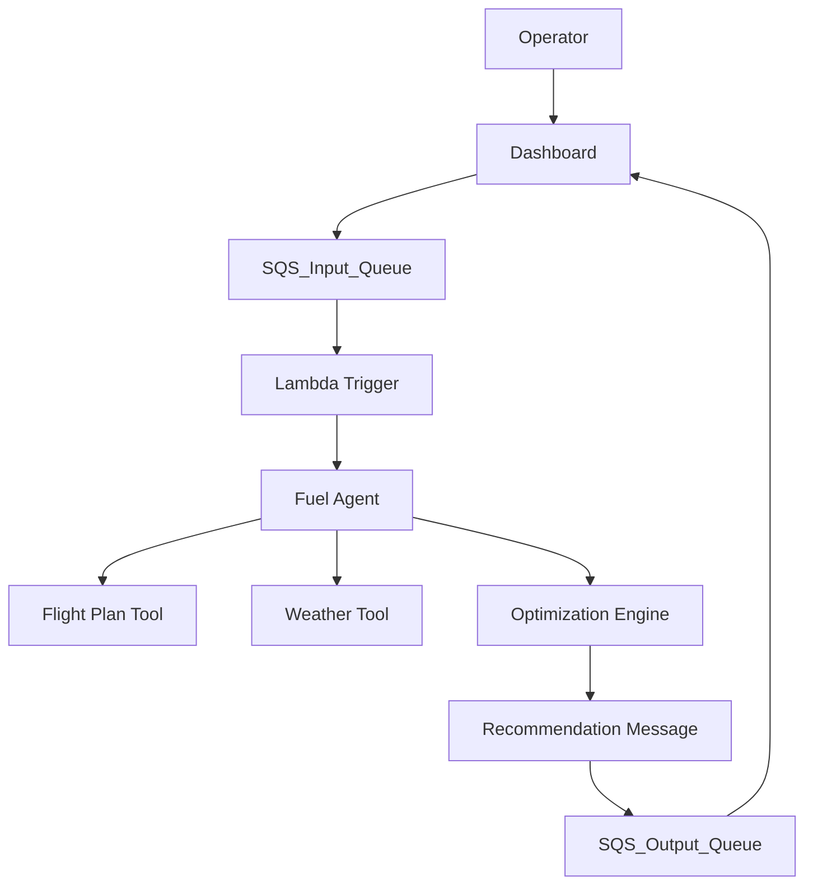

# **Airline Fuel Optimization Agent**

## **1\. Overview**

The Airline Fuel Optimization Agent is a sophisticated proof-of-concept system that leverages an AI agent to analyze flight plans, real-time weather data, and aircraft performance models. Its mission is to recommend the most fuel-efficient flight routes and altitude profiles, directly addressing a critical operational cost for airlines.

This project demonstrates a modern, cloud-native, and decoupled architecture using **AWS Strands** for agentic orchestration, **Amazon Bedrock** for AI reasoning, and a robust **A* search algorithm** for its core optimization logic. The entire workflow is designed to be event-driven and scalable, using **AWS SQS** as the primary message bus to separate the user-facing dashboard from the backend processing agent.

## **2\. System Architecture**

<figure>

<figcaption><strong>Figure:</strong> System architecture (minimal Mermaid). If Mermaid doesn't render on your GitHub instance, add a PNG fallback at <code>/diagrams/arch.png</code>.</figcaption>
</figure>


## **3\. Features**

* **Agent-Driven Workflow:** Utilizes the **AWS Strands SDK** for a model-driven agent that orchestrates the entire optimization process.  
* **A* Based Optimization:** Implements a scientifically sound A* search algorithm to find the optimal path across a 3D graph of waypoints and flight levels.  
* **Physics-Based Fuel Modeling:** Integrates the openap library to provide credible fuel burn estimates.  
* **Real-time Weather Integration:** Fetches current METAR and TAF weather reports to inform the optimization model.  
* **Decoupled & Scalable Architecture:** Uses **AWS SQS** as a robust, cloud-native message bus to create a resilient, event-driven system.  
* **Interactive Dashboard:** A **Streamlit**-based "Mission Control Dashboard" provides a user-friendly interface for initiating optimizations and viewing results.  
* **Cloud-Native Deployment:** Containerized with **Docker** for reproducible and scalable deployment on serverless platforms like **AWS Lambda**.

## **4\. Technology Stack**

| Technology | Role |
| :---- | :---- |
| 🐍 **Python 3.11+** | Core programming language for all components. |
| 🧠 **AWS Strands** | Open-source SDK for building the AI agent. |
| 🤖 **Amazon Bedrock** | Provides the Claude 3 Sonnet LLM for agent reasoning. |
| 📨 **AWS SQS** | Cloud-native message queue for decoupling services. |
| 📦 **Docker** | Containerization for reproducible deployment. |
| ☁️ **AWS Lambda** | Serverless compute for the backend agent. |
| 📊 **Streamlit** | Framework for the interactive web dashboard. |
| ✈️ **OpenAP** | Library for aircraft performance modeling. |

## **5\. Dataset Used**

The proof-of-concept relies on a sample dataset named flight_plans.csv. This file contains mock flight plans that serve as the input for the optimization agent.

**File Structure:**

| Column | Data Type | Description | Example |
| :---- | :---- | :---- | :---- |
| flight_id | String | A unique identifier for the flight. | UA123 |
| origin_airport | String | The ICAO code for the flight's origin airport. | KJFK |
| destination_airport | String | The ICAO code for the flight's destination airport. | KSFO |
| waypoints | String | A JSON-formatted list of ICAO codes representing the flight path. | ["JFK", "SWL", "PSB", "BZN", "SFO"] |
| initial_mass_kg | Integer | The initial take-off mass of the aircraft in kilograms. | 150000 |
| aircraft_type | String | The ICAO code for the specific aircraft model. | B772 |

## **6\. Setup and Installation Guide**<div style="background-color:#e6f4ff;padding:12px;border-radius:6px;">

### **A. Local Environment (Conda)**

1. **Clone the Repository:**  
```bash
   git clone https://github.com/YOUR_USERNAME/airline-fuel-optimizer.git  
   cd airline-fuel-optimizer

2. **Create and Activate Conda Environment:**  
   conda create -n fuel_agent python=3.11 -y  
   conda activate fuel_agent

3. **Install Dependencies:**  
   pip install -r requirements.txt

4. Configure AWS Credentials:  
   On macOS/Linux:  
   export AWS_ACCESS_KEY_ID="YOUR_KEY_HERE"  
   export AWS_SECRET_ACCESS_KEY="YOUR_SECRET_HERE"  
   export AWS_REGION="us-east-1"
```
   *On Windows (Command Prompt):*  
```bash
   set AWS_ACCESS_KEY_ID="YOUR_KEY_HERE"  
   set AWS_SECRET_ACCESS_KEY="YOUR_SECRET_HERE"  
   set AWS_REGION="us-east-1"
```
### **B. Local Environment (venv)**

1. Create and Activate Virtual Environment:  
   On macOS/Linux:  
   python3 -m venv venv  
   source venv/bin/activate

   *On Windows:*  
```bash
   python -m venv venv  
   .\\venv\\Scripts\\activate
```
2. **Install Dependencies & Configure Credentials:** Follow steps 3 and 4 from the Conda setup.

### **C. Cloud Environment (Google Colab)**

1. **Configure AWS Credentials Securely:** Use the **Secrets Manager** (key icon) to add AWS_ACCESS_KEY_ID and AWS_SECRET_ACCESS_KEY.  
2. **Setup Cell:** Run this in the first cell of your notebook.  
   # Install all required packages  
   \!pip install -r requirements.txt

   # Load secrets securely into the environment  
   import os  
   from google.colab import userdata

   os.environ['AWS_ACCESS_KEY_ID'] \= userdata.get('AWS_ACCESS_KEY_ID')  
   os.environ['AWS_SECRET_ACCESS_KEY'] \= userdata.get('AWS_SECRET_ACCESS_KEY')  
   os.environ['AWS_REGION'] \= "us-east-1" # Or your preferred region

</div>

## **7\. How to Run the Application**<div style="background-color:#e6f4ff;padding:12px;border-radius:6px;">

### **Step 1: Start the User Interface**

Open a terminal (with your environment activated) and run:

```bash
streamlit run streamlit1.py
```
### **Step 2: Run the Agent Logic**

Open a **separate terminal** (with your environment activated) and run:

```bash
python notebook_style_runner.py
```
### **Step 3: View Results**

Go back to your Streamlit dashboard and click the **"Check for New Recommendations"** button.

</div>

## **8\. Deployment to AWS Lambda**<div style="background-color:#e6f4ff;padding:12px;border-radius:6px;">

### **Build and Deploy Steps**

1. **Build the Docker Image:**  
```bash
   docker build --no-cache -t fuel-optimization-agent -f Dockerfile2 .
```
2. **Push to Amazon ECR** and create a Lambda function using the container image URI.

</div>

## **9\. License**

This project is licensed under the MIT License. See the LICENSE file for details.