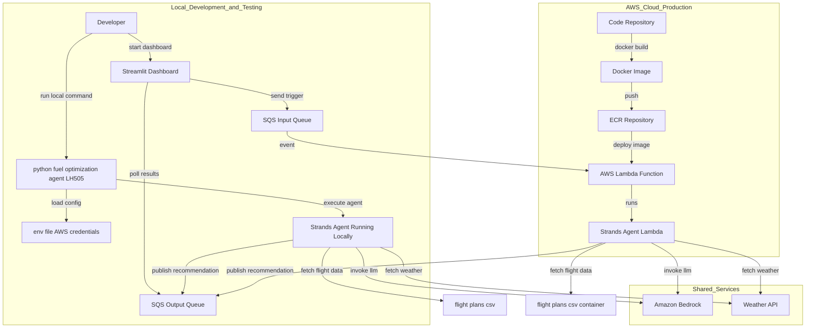

```mermaid
graph TD
  %% Ultra safe Mermaid for GitHub: only letters numbers spaces in labels, no punctuation inside labels

  subgraph Local_Development_and_Testing
    direction LR
    dev[Developer]
    cli[python fuel optimization agent LH505]
    env_file[env file AWS credentials]
    local_agent[Strands Agent Running Locally]
    streamlit_app[Streamlit Dashboard]
    sqs_in[SQS Input Queue]
    sqs_out[SQS Output Queue]

    dev -->|run local command| cli
    cli -->|load config| env_file
    cli -->|execute agent| local_agent
    dev -->|start dashboard| streamlit_app
    streamlit_app -->|send trigger| sqs_in
    streamlit_app -->|poll results| sqs_out
  end

  subgraph AWS_Cloud_Production
    direction TB
    repo[Code Repository]
    docker_img[Docker Image]
    ecr[ECR Repository]
    lambda_fn[AWS Lambda Function]
    lambda_agent[Strands Agent Lambda]

    repo -->|docker build| docker_img
    docker_img -->|push| ecr
    sqs_in -->|event| lambda_fn
    ecr -->|deploy image| lambda_fn
    lambda_fn -->|runs| lambda_agent
  end

  subgraph Shared_Services
    direction TB
    bedrock[Amazon Bedrock]
    weather_api[Weather API]
  end

  local_agent -->|fetch flight data| flight_csv[flight plans csv]
  lambda_agent -->|fetch flight data| flight_csv_lambda[flight plans csv container]

  local_agent -->|invoke llm| bedrock
  lambda_agent -->|invoke llm| bedrock

  local_agent -->|fetch weather| weather_api
  lambda_agent -->|fetch weather| weather_api

  local_agent -->|publish recommendation| sqs_out
  lambda_agent -->|publish recommendation| sqs_out
```

